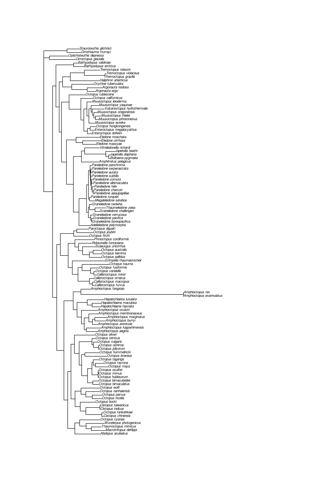

# Loading Libraries
```{r Libraries, message=FALSE, warning=FALSE}
library(ape)
library(xlsx)
library(insect)
library(aphid)
library(DECIPHER)
library(magrittr)
library(phangorn)
library(rwty)
library(stringi)
library(Biostrings)
library(dplyr)
library(knitr)
library(colorRamps)
```


This function to convert DNAbin objects used by the ape package to DNAStringSet objects used by the DECIPHER package was written by Joel Nitta, available on his github (https://gist.github.com/joelnitta/6f30a7c0f1c83d78c76a5469e935d56f)
```{r}
# Convert ape::DNAbin format to Biostrings::DNAStringSet format,
# optionally removing gaps
DNAbin_to_DNAstringset <- function (seqs, remove_gaps = TRUE) {
  if(isTRUE(remove_gaps)) {
  seqs %>% as.list() %>% as.character %>% 
      lapply(.,paste0,collapse="") %>% 
      lapply( function (x) gsub("-", "", x)) %>% 
      unlist %>% Biostrings::DNAStringSet()
  } else {
    seqs %>% as.list() %>% as.character %>% 
      lapply(.,paste0,collapse="") %>% 
      unlist %>% Biostrings::DNAStringSet()
  }
}
```


# Preparing the dataset
## Reading in accession numbers
First I read in the accession numbers and 
```{r}
access=read.csv("Octopus burrowing - data.csv",na.strings = "")
colnames(access)=c("Species","burrow","keel","reference","COI","COIII","12S","16S","28S","Rhodopsin","Pax-6","cytb","notes")
access=access[,1:13] #Dropping the junk columns
access=access[,-c(4,13)] #Dropping notes and references columns
```


I am dropping all of the taxa for which sequences for all three genes (COIII, CytB and 12s) are available.  The one exception is Octopus rubescens, which some reviewers have asked me to include so that I could exclude both octopus species that occur in the same area.
```{r}
#access=access[complete.cases(access)|access$NA.=="Octopus_rubescens",] 
```

Next, I am limiting the dataset to only a single set of sequences for each species or subspecies.
```{r}
#access=access[!grepl("_\\d",access$NA.),]
```

Finally, I am making a table of the accession #s used in this analysis.
```{r}
access.kable=access
colnames(access.kable)=c("Species","burrow","keel","COI","COIII","12S","16S","28S","Rhodopsin","Pax-6","cytb")
kable(access.kable,row.names = F)
```

# Multi-Gene Tree
First, I am constructing a tree using all three genes.  

## 12s
### Reading Sequences from GenBank and QC
I use ape's read.GenBank command to go out and get the specific sequences. I tried to write all of this code so that it would still work if I didn't have complete coverage of all genes for all species (for instance, if I used all of the species in "Enteroctopodidae_and_Outgroup.csv" regardless if they had all three genes sequenced).  So here, if any of the taxa have an "NA" entered for 12s, I replace it with the accession # DJ078208.  This access number is for a single A. Why in the world did someone upload a single A nucleotide to GenBank and how did it get through GenBanks' QC?  I have no clue, but I am going to use it here to as a handy place-holder for missing data.
```{r}
x12s.accession=access$X12s
x12s.accession[is.na(x12s.accession)]="DJ078208"
x12s=read.GenBank(x12s.accession)
x12s[names(x12s)=="DJ078208"]=as.DNAbin("-")
names(x12s)=access$NA.
```

As is the case with with a lot of the sequences you get from Genbank, all of the sequences are not same strand, and the reverse complement will need to be taken for those sequences.
To determine which sequences need this done, I am looking at the pattern of base frequencies for each sequence.  
I probably could have built the object with some apply family function instead of a for loop if I knew that group of functions better...
This first bit of code builds a base frequency table for me to use to evaluate the sequences.
```{r}
x12s.bases=base.freq(x12s[1])
for (i in 2:length(x12s)){
  x12s.bases=rbind(x12s.bases,base.freq(x12s[i]))  
}
rownames(x12s.bases)=names(x12s)
```

First I am looking at the C:G ratio of each 12s sequence in the first plot, the second plot looks at the C:G ratio against the A:T ratio.  The outliers in these plots are likely the opposite strand from the other sequences.
```{r}
plot(x12s.bases[,2]/x12s.bases[,3],ylim=c(0,2.8))
plot(x12s.bases[,2]/x12s.bases[,3],x12s.bases[,1]/x12s.bases[,4])
abline(h=1,col="red")
abline(v=1,col="red")
```

Therefore, I an taking the reverse complement for all of the sequences for which the C:G ratio is larger than 1.
```{r}
revcomp=which(x12s.bases[,2]/x12s.bases[,3]>=1)
```


```{r}
for (i in revcomp){
  x12s[i]=ape::complement(x12s[i])
}
```

Finally, I am going to make the C:G ratio plot again to make sure the sequences look good now.
```{r}
x12s.bases=base.freq(x12s[1])
for (i in 2:length(x12s)){
  x12s.bases=rbind(x12s.bases,base.freq(x12s[i]))  
}
rownames(x12s.bases)=names(x12s)
plot(x12s.bases[,2]/x12s.bases[,3],ylim=c(0,2.8))
```
### Alignment of 12s to secondary structure
Because 12s does not code for protein, but is instead a structural rRNA molecule, it should be aligned via secondary structure.  I am going to do that using a program called LocaRNA.  For doing relatively small sequence sets, the webserver is available at https://rna.informatik.uni-freiburg.de/LocARNA and works very well. However, for the size of dataset I am working with, I needed to use a local installation.
First off, I write the 12s sequences out to a fasta file. Notice that I am removing all of the "NA" sequences.  
```{r}
write.FASTA(x12s[!is.na(access$X12s)],"12s.fasta")
```

Next, I use the following BASH commands to make a directory to perform this alignment in, and copy the fasta file into that directory and a pearl script I will use later. 
```{bash}
mkdir 12s
cp 12s.fasta 12s
cp dotbracket2indexPairs.pl 12s
```

Now, I actually call the program to perform the alignment.
```{bash, eval=F}
cd 12s
mlocarna --free-endgaps --keep-sequence-order --cpus=20 --stockholm --write-structure 12s.fasta > LocARNA.output
```

After the alignment is done, some post-processing needs to be done to get the base pairs of the stem segments of the rRNA. This includes the following BASH commands and the pearl script. This post-processing is done automatically on the webserver of LocaRNA, but needs to be done manually when using the local installation. These BASH commands and pearl script were provided by Martin Raden. I will be using these base pairs later to construct the MrBayes command block in the nexus file I will be generating to run the analysis.
```{bash}
cd 12s
##########################
# step 1: extraction of RNAalifold consensus structure
##########################

cat LocARNA.output | awk 'BEGIN{p=0;}{if(p!=0){printf$1;if(NF>1){p=0;}}else{if($1=="alifold"){p=1;printf$2;if(NF>2){p=0;}}}}END{print ""}' > LocARNA.RNAalifold.consensus;

##########################
# step 1: convert dot-bracket to index information
##########################

perl dotbracket2indexPairs.pl `cat LocARNA.RNAalifold.consensus` > LocARNA.RNAalifold.consensus.bp

```


Now that the alignment is completed, I need to get it into R. In order to get this to read into R via the read.dna command, I need to do a few alterations to the file.  Specifically I need to add a "*" between the interleaved block.
```{r}
x12s.txt=readLines("12s/12s.out/results/result.aln")
sp=length(x12s[!is.na(access$X12s)])
txt=length(x12s.txt)
spaces=max(nchar(names(x12s[!is.na(access$X12s)])))+1
string=paste(paste(rep(" ",spaces),sep="",collapse=""),"*",sep="")
rep.lines=seq(from=sp+4,to=txt,by=sp+1)
x12s.txt[rep.lines]=string
x12s.txt=gsub("U","T",x12s.txt)
writeLines(x12s.txt,"12s_result_mod.aln")
```
Then, I can read the alignment file into R.
```{r}
x12s.align=read.dna("12s_result_mod.aln",format="clustal")
```

### Determining best model of molecular evolution
Next up, I want to find the appropriate model of molecular evolution to use for the phylogenetic analysis. I want to do this separately for the loops and stems of the rRNA because it is likely there are very different selection happening on these regions.  
Generally, in order to separate those, I will read in the base pairs from the LocaRNA output. These are the stems. The remaining bases are the loops.  

First, I use the following BASH command to append an empty line to the end of the basepair file I produced so the readLines command will work properly.
```{bash}
sed -i -e '$a\' ./12s/LocARNA.RNAalifold.consensus.bp
```


In the following bit of R code, I read in the basepairs file. Then, I use gsub to extract the positions of the base pairs by replacing each colon and each space with a comma.  
```{r}
base.pairs.12s=readLines("12s/LocARNA.RNAalifold.consensus.bp")
base.pairs.12s=gsub("^ ","",base.pairs.12s)
stems.12s=gsub(":",",",base.pairs.12s)
stems.12s=gsub(" ",",",stems.12s)
writeLines(stems.12s,"basepairs_12s.csv")
stems.12s=as.vector(t(read.csv("basepairs_12s.csv",header=F)[1,]))
stems.12s=sort(stems.12s)
```

The I use those positions to subset the 12s alignment.  And then I re-align the subseted sequences.
```{r message=FALSE, warning=FALSE, results='hide'}
stems.12s.align=x12s.align[,stems.12s]
stems.12s.align=DNAbin_to_DNAstringset(stems.12s.align)
stems.12s.align=AlignSeqs(stems.12s.align)
stems.12s.align=as.DNAbin(stems.12s.align)
```


Then I take all of the positions that are not stems, and make another subset of those, which are the loops. I also re-align that subset.
```{r message=FALSE, warning=FALSE, results='hide'}
loops.12s=1:length(x12s.align[1,])
loops.12s=loops.12s[-stems.12s]
loops.12s.align=x12s.align[,loops.12s]
loops.12s.align=DNAbin_to_DNAstringset(loops.12s.align)
loops.12s.align=AlignSeqs(loops.12s.align)
loops.12s.align=as.DNAbin(loops.12s.align)
```


I now use modelTest to find the fit of a list of potential models of molecular evolution to my stems data.
```{r}
x12s.stems.dist=dist.dna(stems.12s.align)
x12s.stems.nj=NJ(x12s.stems.dist)
x12s.stems.pd=as.phyDat(stems.12s.align)
x12s.stems.mT=modelTest(x12s.stems.pd,x12s.stems.nj,
                        model=c("GTR","SYM","K80","HKY","F81","JC"),
                        multicore=T,mc.cores=4)
```

And then we order to results to find the best fit based on AICc.
```{r}
x12s.stems.mT=x12s.stems.mT[order(x12s.stems.mT$AICc),]
x12s.stems.mT$Model=gsub("\\(\\d\\)","",x12s.stems.mT$Model)
x12s.stems.mT$Model[1]
mt=character()
mt[1]=x12s.stems.mT$Model[1]
```

Then, I repeat this process on the loops
```{r}
x12s.loops.dist=dist.dna(loops.12s.align)
x12s.loops.nj=NJ(x12s.loops.dist)
x12s.loops.pd=as.phyDat(loops.12s.align)
x12s.loops.mT=modelTest(x12s.loops.pd,x12s.loops.nj,
                        model=c("GTR","SYM","K80","HKY","F81","JC"),
                        multicore=T,mc.cores=4)
```

```{r}
x12s.loops.mT=x12s.loops.mT[order(x12s.loops.mT$AICc),]
x12s.loops.mT$Model=gsub("\\(\\d\\)","",x12s.loops.mT$Model)
x12s.loops.mT$Model[1]
mt[2]=x12s.loops.mT$Model[1]
```

### Creating nexus file
Next up, we are adding back in the NA sequences as a string of gaps and writing out the data as a nexus file.  This will be integrated into the complete nexus file of all three genes later on.
```{r}
x12s.proto=matrix(ncol=length(x12s.align[1,]),nrow=nrow(access),data="-")
rownames(x12s.proto)=access$NA.
x12s.final=as.DNAbin(x12s.proto)

for (i in 1:length(labels(x12s.align))){
  x12s.final[which(access$NA.==labels(x12s.align)[i]),]=x12s.align[i,]
}

write.nexus.data(x12s.final,"12s.nxs",charsperline = 1000)

```


FOr some odd reason, this process leaves a ton of NAs at the end of each sequence.  There fore, I need to trim the string of NAs from the end of the sequence.  First, I find out how many characters should appear per line.
```{r}
length(x12s.final[1,])+max(nchar(labels(x12s.final)))+10
```
Next, I am using sed to trim the lines to that length.

```{bash}
sed -i -E 's/(^.{536}).*/\1/g' 12s.nxs
```

Then, using sed to remove the last two lines of the file that have the "end;"
```{bash}
sed -i "$(( $(wc -l <12s.nxs)-3+1 )),$ d" 12s.nxs
```


## COIII
### Sequencing reading and QC
Now, I am going to repeat the process I followed with 12s with the COIII sequences with only a few modifications. Therefore, I will annotate this less. 
```{r}
coiii.accession=access$COIII
coiii.accession[is.na(coiii.accession)]="DJ078208"
coiii=read.GenBank(coiii.accession)
coiii[names(coiii)=="DJ078208"]=as.DNAbin("-")
names(coiii)=access$NA.
```

Building a base frequency table.
```{r}
coiii.bases=base.freq(coiii[1])
for (i in 2:length(coiii)){
  coiii.bases=rbind(coiii.bases,base.freq(coiii[i]))  
}
rownames(coiii.bases)=names(coiii)
```


finding any possible sequences that need to be reverse complemented
```{r}
plot(coiii.bases[,1]/coiii.bases[,4],ylim=c(0,2.8))
plot(coiii.bases[,1]/coiii.bases[,4],coiii.bases[,2]/coiii.bases[,3],ylim=c(0,2.8),xlim=c(0,3))
abline(v=1,col="red")
abline(h=1,col="red")
```

These look pretty good overall, so I don't need to do much with them.


### Sequence alignment
Alignment is a lot more straight forward for these sequence since they are protein coding and not structural.  Here, I can just use the AlignSeqs function from DECIPHER package.
```{r message=FALSE, warning=FALSE, results='hide'}
coiii2=DNAbin_to_DNAstringset(coiii)
coiii.align=AlignSeqs(coiii2)
coiii.stag=StaggerAlignment(coiii.align)
coiii.final=as.DNAbin(coiii.stag)
```


### Creating nexus file
```{r}
coiii.final=as.DNAbin(coiii.stag)
write.nexus.data(coiii.final,"coiii.nxs",charsperline = 1000)
```

Findig the place to start trimming to get rid of the trailing NAs
```{r}
length(coiii.final$Octopus_vulgaris)+max(nchar(labels(coiii.final)))+10
```
trimming off NA's
```{bash}
sed -i -E 's/(^.{711}).*/\1/g' coiii.nxs
```

Then, using sed to remove the last two lines of the file
```{bash}
sed -i "$(( $(wc -l <coiii.nxs)-3+1 )),$ d" coiii.nxs
```

### Model Test
In this case, I want to partition the dataset into each of the three codon positions. That will be done in the MrBayes command block and not here. However, I do need to run model test for each codon position independently. That is what I am doing here. 
```{r}
coiii.dist=dist.dna(coiii.final[!is.na(access$COIII)])
coiii.nj=NJ(coiii.dist)
coiii.pd=as.phyDat(coiii.final[!is.na(access$COIII)])
```

```{r}
coiii.length=length(coiii$Octopus_vulgaris)
```


COIII codon position 1
```{r}
coiii.1.mT=modelTest(coiii.pd[,seq(from=1,to=coiii.length,by=3)],coiii.nj,
                        model=c("GTR","SYM","K80","HKY","F81","JC"),
                        multicore=T,mc.cores=4)
coiii.1.mT=coiii.1.mT[order(coiii.1.mT$AICc),]
coiii.1.mT$Model=gsub("\\(\\d\\)","",coiii.1.mT$Model)
coiii.1.mT$Model[1]
mt[3]=coiii.1.mT$Model[1]
```

COIII codon position 2
```{r}
coiii.2.mT=modelTest(coiii.pd[,seq(from=2,to=coiii.length,by=3)],coiii.nj,
                        model=c("GTR","SYM","K80","HKY","F81","JC"),
                        multicore=T,mc.cores=4)
coiii.2.mT$Model=gsub("\\(\\d\\)","",coiii.2.mT$Model)
coiii.2.mT=coiii.2.mT[order(coiii.2.mT$AICc),]
coiii.2.mT$Model[1]
mt[4]=coiii.2.mT$Model[1]
```

COIII codon position 3
```{r}
coiii.3.mT=modelTest(coiii.pd[,seq(from=3,to=coiii.length,by=3)],coiii.nj,
                        model=c("GTR","SYM","K80","HKY","F81","JC"),
                        multicore=T,mc.cores=4)
coiii.3.mT=coiii.3.mT[order(coiii.3.mT$AICc),]
coiii.3.mT$Model=gsub("\\(\\d\\)","",coiii.3.mT$Model)
coiii.3.mT$Model[1]
mt[5]=coiii.3.mT$Model[1]
```

## CytB 
### Sequence reading and QC
CytB analysis is nearly identical to COIII, so I will have even less annotation here. 
```{r}
cytb.accession=access$Cytb
cytb.accession[is.na(cytb.accession)]="DJ078208"
cytb=read.GenBank(cytb.accession)
cytb[names(cytb)=="DJ078208"]=as.DNAbin("-")
names(cytb)=access$NA.
```


```{r}
cytb.bases=base.freq(cytb[1])
for (i in 2:length(cytb)){
  cytb.bases=rbind(cytb.bases,base.freq(cytb[i]))  
}
rownames(cytb.bases)=names(cytb)
```

```{r}
plot(cytb.bases[,2]/cytb.bases[,3],ylim=c(0,2.8))
```
### Sequence alignment

```{r, results='hide'}
cytb2=DNAbin_to_DNAstringset(cytb)
cytb.align=AlignSeqs(cytb2)
```

```{r}
cytb.stag=StaggerAlignment(cytb.align)
```


### Creating nexus file
```{r}
cytb.final=as.DNAbin(cytb.stag)
write.nexus.data(cytb.final,"cytb.nxs",charsperline = 1000)
```


```{r}
length(cytb.final$Octopus_vulgaris)+max(nchar(labels(cytb.final)))+10
```

```{bash}
sed -i -E 's/(^.{675}).*/\1/g' cytb.nxs
```

Then, using sed to remove the last two lines of the file
```{bash}
sed -i "$(( $(wc -l <cytb.nxs)-3+1 )),$ d" cytb.nxs
```


### Model Test

```{r}
cytb.dist=dist.dna(cytb.final[!is.na(access$Cytb)])
cytb.nj=NJ(cytb.dist)
cytb.pd=as.phyDat(cytb.final[!is.na(access$Cytb)])
```


```{r}
cytb.length=length(cytb$Octopus_vulgaris)
```


Cytb codon position 1
```{r}
cytb.1.mT=modelTest(cytb.pd[,seq(from=1,to=cytb.length,by=3)],cytb.nj,
                        model=c("GTR","SYM","K80","HKY","F81","JC"),
                        multicore=T,mc.cores=4)
cytb.1.mT=cytb.1.mT[order(cytb.1.mT$AICc),]
cytb.1.mT$Model=gsub("\\(\\d\\)","",cytb.1.mT$Model)
cytb.1.mT$Model[1]
mt[6]=cytb.1.mT$Model[1]
```

Cytb codon postion 2
```{r}
cytb.2.mT=modelTest(cytb.pd[,seq(from=2,to=cytb.length,by=3)],cytb.nj,
                        model=c("GTR","SYM","K80","HKY","F81","JC"),
                        multicore=T,mc.cores=4)
cytb.2.mT=cytb.2.mT[order(cytb.2.mT$AICc),]
cytb.2.mT$Model=gsub("\\(\\d\\)","",cytb.2.mT$Model)
cytb.2.mT$Model[1]
mt[7]=cytb.2.mT$Model[1]
```

Cytb codon postion 3
```{r}
cytb.3.mT=modelTest(cytb.pd[,seq(from=3,to=cytb.length,by=3)],cytb.nj,
                        model=c("GTR","SYM","K80","HKY","F81","JC"),
                        multicore=T,mc.cores=4)
cytb.3.mT=cytb.3.mT[order(cytb.3.mT$AICc),]
cytb.3.mT$Model=gsub("\\(\\d\\)","",cytb.3.mT$Model)
cytb.3.mT$Model[1]
mt[8]=cytb.3.mT$Model[1]
```

## Models Selected
Finally, I have been saving the models selected for each parition in an object names "mt".  Here I put together that information and related information to put in a table.
```{r}
Nst=rep(6,length(mt))
Nst[grepl("K80|HKY",mt)]=2
Nst[grepl("JC|F81",mt)]=1

rate=rep("",8)
rate[grepl("\\+I",mt)]="propinv"
rate[grepl("\\+G",mt)]="gamma"
rate[grepl("\\+G\\+I",mt)]="invgamma"

models.selected=
data.frame(partition=c("12s stems",
                       "12s loops",
                       "COXIII pos 1",
                       "COXIII pos 2",
                       "COXIII pos 3",
                       "CytB pos 1",
                       "CytB pos 2",
                       "CytB pos 3"),
           length=c(length(stems.12s),
                    length(loops.12s),
                    floor(length(coiii.align$Octopus_vulgaris)/3+.67),
                    floor(length(coiii.align$Octopus_vulgaris)/3+.34),
                    floor(length(coiii.align$Octopus_vulgaris)/3),
                    floor(length(cytb.align$Octopus_vulgaris)/3+.67),
                    floor(length(cytb.align$Octopus_vulgaris)/3+.34),
                    floor(length(cytb.align$Octopus_vulgaris)/3)),
           model=mt,
           nucmodel=c("doublet",rep("4by4",7)),
           Nst,
           rate)
models.selected$model=gsub("\\+G","+Γ",models.selected$model)
write.csv(models.selected,"models_selected.csv",row.names = F)
kable(models.selected,align=c("l","c","c","c","c","r"))
```

## Combine nexus file production
THe final step of the data preparation it so make a combine nexus file of all three genes and the MrBayes command block. 
First, I am writing the 12s stem and loops positions out to a text file we can incorportate into the nexus file later.
```{r}
write.table(t(stems.12s),"stems12s",sep=" ",row.names = F,col.names = F)
write.table(t(loops.12s),"loops12s",sep=" ",row.names = F,col.names = F)
```

Next, I find the length of the whole dataset
```{r}
total.len=length(x12s.final[1,])+
  length(coiii.final$Octopus_vulgaris)+
  length(cytb.final$Octopus_vulgaris)
total.len
```
The start of the coiii dataset:
```{r}
coiii.start=length(x12s.final[1,])+1
coiii.start
```
The start of the cytb dataset:
```{r}
cytb.start=length(x12s.final[1,])+
  length(coiii.final$Octopus_vulgaris)+1
cytb.start
```

### Making the model selection block
Next, I construct the part of the MrBayes command block in which I will apply the settings for each model selected.  I am using a look-up table of settings I produced and stored in the "model_selection.csv" file. I then write this part of the command block out to a text file that I will incorportate into the combine nexus file later.
```{r}
models=read.csv("model_selection.csv")
models.muus=character()
for (i in 1:length(mt)){
  models.muus[i]=paste("      lset applyto=(",i,") ",models$lset[models$model==mt[i]],";",sep="")
}
for (i in 1:length(mt)){
  models.muus[i+length(mt)]=paste("      prset applyto=(",i,") ",models$prset[models$model==mt[i]],";",sep="")
}
models.muus=models.muus[-grep("NA",models.muus)]
write.table(models.muus,"models_to_write",row.names = F,col.names = F,quote = F)
```

### Making the 12s stem base pair block
Now, I am also making a text file that has the 12s stem base pairs.
```{r}
write.table(t(c(as.vector(t(read.csv("basepairs_12s.csv",header=F)[1,])))),"basepairs",row.names = F,col.names = F)
```

And now doing a bit of reformatting of the text file using sed.
```{bash}
sed -i -E 's/([0-9]{2,4}) ([0-9]{2,4})/\1:\2/g' basepairs
```


### Making blocks that require lengths
Here I am making various blocks that require sequence lengths.  That includes the header of the nexux file and the portion of the MrBayes command block paritioning the dataset.
```{r}
write.table(paste("  DIMENSIONS NTAX=",nrow(access)," NCHAR=",total.len,";",sep=""),"dimensions",
            row.names = F,col.names = F,quote = F)

write.table(data.frame(models=c(
            paste("      charset coiii_pos1 =  ",coiii.start," - ",cytb.start-1,"\\3;",sep=""),
            paste("      charset coiii_pos2 =  ",coiii.start+1," - ",cytb.start-1,"\\3;",sep=""),
            paste("      charset coiii_pos3 =  ",coiii.start+2," - ",cytb.start-1,"\\3;",sep="")
            )),
            "charset.coii",
            row.names = F,col.names = F,quote = F)

write.table(data.frame(models=c(
            paste("      charset cytb_pos1 =  ",cytb.start," - ",total.len,"\\3;",sep=""),
            paste("      charset cytb_pos2 =  ",cytb.start+1," - ",total.len,"\\3;",sep=""),
            paste("      charset cytb_pos3 =  ",cytb.start+2," - ",total.len,"\\3;",sep="")
            )),
            "charset.cytb",
            row.names = F,col.names = F,quote = F)

```


### Generating nexus file with MrBayes command block
Finally, we can take all of those text files we produced and use some BASH to create the nexus file that we will use in the analysis. It will be called "complete.nxs".  
```{bash, eval=F}
rm complete.nxs #just cleaning out previous iteration if running multiple times
cp -r mb mb.backup
rm -r mb
touch complete.nxs
echo "#NEXUS" >> complete.nxs
echo "BEGIN DATA;" >> complete.nxs
sed -n 1p dimensions >> complete.nxs
echo "  FORMAT DATATYPE=DNA MISSING=? GAP=- INTERLEAVE=YES;
  MATRIX
  
  [12s]" >> complete.nxs 
sed -n 7,96p 12s.nxs >> complete.nxs
echo "
   [COIII]" >> complete.nxs
sed -n 7,96p coiii.nxs >> complete.nxs
echo "
   [Cytb]" >> complete.nxs
sed -n 7,98p cytb.nxs >> complete.nxs
echo "  ;
END;

begin mrbayes;
	[Define pairs for the doublet model]" >> complete.nxs
cat basepairs | sed '1s/^/    pairs /' | sed -E 's/(:[0-9]{,4})/\1,/g' | sed -E 's/,$/;/g' | sed -r 's/(.{72,76} )/\1\n         /g' >> complete.nxs
echo " " >> complete.nxs
cat stems12s | sed '1s/^/    	charset  12s-stems = /' | sed -E 's/$/;/g' | sed -r 's/(.{73,76} )/\1\n           /g' | sed '1s/^/\n/' >> complete.nxs

echo " " >> complete.nxs
cat loops12s | sed '1s/^/    	charset  12s-loops = /' | sed -E 's/$/;/g' | sed -r 's/(.{73,76} )/\1\n           /g' | sed '1s/^/\n/' >> complete.nxs
echo " " >> complete.nxs
sed -n 1,3p charset.coii >> complete.nxs
sed -n 1,3p charset.cytb >> complete.nxs
echo " " >> complete.nxs
echo "      partition by_gene = 8:12s-stems,12s-loops,coiii_pos1,coiii_pos2,coiii_pos3,cytb_pos1,cytb_pos2,cytb_pos3;" >> complete.nxs
echo "	    set partition = by_gene;
" >> complete.nxs
echo "	    constraint outg = Octopus_vulgaris Octopus_rubescens Octopus_bimaculoides Octopus_cyanea Amphioctopus_aegina Hapalochlaena_maculosa Abdopus_aculeatus Octopus_tetricus Octopus_berrima Macroctopus_maorum;
	    prset topologypr = constraints (outg);
	    outgroup Octopus_vulgaris;
	    " >> complete.nxs
echo "	    lset applyto=(1)   nucmodel=doublet;
	    lset applyto=(2,3,4,6,7,8)   nucmodel=4by4;
	    prset ratepr=variable;
	    unlink statefreq=(all) revmat=(all) shape=(all) pinvar=(all);" >> complete.nxs

cat models_to_write >> complete.nxs

echo "
      mcmcp ngen=100000000 printfreq=1000 samplefreq=10000 stoprule=yes stopval=0.01 nruns=5 nchains=2 burninfrac=0.25;
      mcmc;
      sump;
      sumt filename=mb/complete.nxs contype=allcompat conformat=simple;

end;
" >> complete.nxs

mkdir mb
cp complete.nxs mb/complete.nxs
```

## Running MrBayes analysis
Now, we run the analysis with this BASH command.  I have compiled MrBayes from source with MPI multi-threading enabled.
```{bash, eval=F}
mpiexec -np 10 mb mb/complete.nxs > mb_log
```


## Assessing convergency with RWTY
The R package RWTY (Standing for R We There Yet), is useful for determining if a Bayesian phylogenetic analysis has run for long enough.  Specifically it produces visualizations that help assess if the MCMC chains have converged. 

```{r, eval=F}
octo.trees=load.multi("mb/", format = "mb")
check.chains(octo.trees)
```

```{r, eval=F}
rwty.processors <<- 15
octo.rwty=analyze.rwty(octo.trees,filename="Burrows_Bay_octo_rwty.pdf")
```


### Log likelihood plots
First, we will take a look at the log likelihood traces for the 5 different runs.  We expect these to have no trend in an analysis that has converged. In addition, estimated sample size (ESS) should be above 200 for each parameter. As with most of the graphs in this analysis, trace plots show the change in some factor (y-axis) over successive generations of the analysis (x-axis). This allows you to see if the factor was changing, and in what way, over the course of the analysis. The density plot will show the distribution of that factor over all generations, allowing easy comparison between runs.

```{r RWTY parameter plot, eval=F}
png("LnL_trace.png",width=2000,height=1000,res=200)
makeplot.param(octo.trees, burnin = 50, "LnL")$trace.plot
dev.off()

png("LnL_density.png",width=2000,height=1000,res=200)
makeplot.param(octo.trees, burnin = 50, "LnL")$density.plot
dev.off()

```


In the density plot we are looking to see that the values sampled by each of the runs is approximately the same.


### Tree topology plot
Tree topology trace show the difference in sampled tree topology from the focal tree (on the y-axis) across generations of the bayesian analysis (x-axis). According the documentation: "Well mixed chains will show the topology trace jumping rapidly between values. Poorly mixed chains will show chains remaining at similar values in successive samples. Topology traces can also reveal whether different chains are sampling different bits of tree space, in which case the stationary distributions will show traces at different y values on the plot." (https://cran.r-project.org/web/packages/rwty/vignettes/rwty.html)

```{r RWTY topology plot, eval=F}
png("Topology_trace.png",width=2000,height=1000,res=200)
makeplot.topology(octo.trees, burnin = 50)$trace.plot
dev.off()
```

### Split frequency plots
Next up, we look at the split frequency plots. According to the documentation for the functions:
"In an analysis that is mixing well, we expect the frequencies in the sliding window to move around a lot, but the frequencies in the cumulative plot should level off. If the frequencies in the cumulative plot have not leveled off, it might be necessary to run the chain for longer." 

```{r RWTY sliding split frequencies, eval=F}
png("sliding_split_freq.png",width=2000,height=1000,res=200)
makeplot.splitfreqs.sliding(octo.trees, burnin = 50)
dev.off()
```


```{r RWTY cumulative split frequencies, eval=F}
png("cumulative_split_freq.png",width=2000,height=1000,res=200)
makeplot.splitfreqs.cumulative(octo.trees, burnin = 50)
dev.off()
```


### Tree space heatmap
This plot show the areas of treespace sampled by each run.

```{r RWTY treespace plot, eval=F}
png("treespace_heatmap.png",width=2000,height=1000,res=200)
makeplot.treespace(octo.trees, burnin =50, fill.color = "LnL")$treespace.heatmap
dev.off()
```


### Split Frequency Matrix

```{r RWTY split frequency matrix plot, eval=F}
png("split_freq_matrix.png",width=2000,height=1000,res=200)
makeplot.splitfreq.matrix(octo.trees, burnin = 50)$splitfreq.matrix
dev.off()
```


Finally, I am removing the octo.trees and octo.rwty object because they are super big.
```{r, warning=F, message=F}
rm(octo.trees)
rm(octo.rwty)
```


# Single Gene Trees
In the final figure I want to also include trees constructed from each gene individually as well. This section of the code follows the same process as the multi-gene tree section, but with only one gene at a time.  

## 12s Only Tree
```{r}
x12s.solo=x12s.final[complete.cases(access$X12s),]
write.nexus.data(x12s.solo,"12s_solo.nxs",charsperline = 1000)
length(x12s.solo[1,])+max(nchar(labels(x12s.solo)))+10
```


```{bash}
sed -i -E 's/(^.{536}).*/\1/g' 12s_solo.nxs
```

### Writing length variable lines
```{r}
write.table(paste("  DIMENSIONS NTAX=",
                  dim(x12s.solo)[1],
                  " NCHAR=",
                  dim(x12s.solo)[2],
                  ";",sep=""),
            "12s_dimensions",
            row.names = F,col.names = F,quote = F)

write.table(models.muus[grepl("\\(1\\)|\\(2\\)",models.muus)],
            "12s_models_to_write",row.names = F,col.names = F,quote = F)
```


### Generating nexus file with MrBayes command block. 
```{bash, eval=F}
rm 12s_alone.nxs #just cleaning out previous iteration if running multiple times
cp -r mb_12s mb_12s.backup
rm -r mb_12s
touch 12s_alone.nxs
echo "#NEXUS" >> 12s_alone.nxs
echo "BEGIN DATA;" >> 12s_alone.nxs
sed -n 1p 12s_dimensions >> 12s_alone.nxs
echo "  FORMAT DATATYPE=DNA MISSING=? GAP=- INTERLEAVE=YES;
  MATRIX
  
  [12s]" >> 12s_alone.nxs 
sed -n 7,96p 12s_solo.nxs >> 12s_alone.nxs
echo "
begin mrbayes;
	[Define pairs for the doublet model]" >> 12s_alone.nxs
cat basepairs | sed '1s/^/    pairs /' | sed -E 's/(:[0-9]{,4})/\1,/g' | sed -E 's/,$/;/g' | sed -r 's/(.{72,76} )/\1\n         /g' >> 12s_alone.nxs
echo " " >> 12s_alone.nxs
cat stems12s | sed '1s/^/    	charset  12s-stems = /' | sed -E 's/$/;/g' | sed -r 's/(.{73,76} )/\1\n           /g' | sed '1s/^/\n/' >> 12s_alone.nxs

echo " " >> 12s_alone.nxs
cat loops12s | sed '1s/^/    	charset  12s-loops = /' | sed -E 's/$/;/g' | sed -r 's/(.{73,76} )/\1\n           /g' | sed '1s/^/\n/' >> 12s_alone.nxs
echo " " >> 12s_alone.nxs
echo "      partition by_gene = 2:12s-stems,12s-loops;" >> 12s_alone.nxs
echo "	    set partition = by_gene;
" >> 12s_alone.nxs
echo "	    constraint outg = Octopus_vulgaris Octopus_rubescens Octopus_bimaculoides Octopus_cyanea Amphioctopus_aegina Hapalochlaena_maculosa Abdopus_aculeatus Octopus_tetricus Octopus_berrima Macroctopus_maorum;
	    prset topologypr = constraints (outg);
	    outgroup Octopus_vulgaris;
	    " >> 12s_alone.nxs
echo "	    lset applyto=(1)   nucmodel=doublet;
	    lset applyto=(2)   nucmodel=4by4;
	    prset ratepr=variable;
	    unlink statefreq=(all) revmat=(all) shape=(all) pinvar=(all);" >> 12s_alone.nxs

cat 12s_models_to_write >> 12s_alone.nxs

echo "
      mcmcp ngen=100000000 printfreq=1000 samplefreq=10000 stoprule=yes stopval=0.01 nruns=5 nchains=2 burninfrac=0.25;
      mcmc;
      sump;
      sumt filename=mb_12s/12s_alone.nxs conformat=simple;

end;
" >> 12s_alone.nxs

mkdir mb_12s
cp 12s_alone.nxs mb_12s/12s_alone.nxs
```

### Running the MrBayes analysis

```{bash, eval=F}
mpiexec -np 10 mb mb_12s/12s_alone.nxs > mb_12s_log
```

## COIII Only Tree
```{r}
coiii.solo=coiii.final[complete.cases(access$COIII)]
write.nexus.data(coiii.solo,"coiii_solo.nxs",charsperline = 1000)
length(coiii.solo$Octopus_vulgaris)+max(nchar(labels(coiii.solo)))+10
```


```{bash}
sed -i -E 's/(^.{711}).*/\1/g' coiii_solo.nxs
```

### Writing length variable lines
```{r}
write.table(paste("  DIMENSIONS NTAX=",
                  length(coiii.solo),
                  " NCHAR=",
                  length(coiii.solo$Octopus_vulgaris),
                  ";",sep=""),
            "coiii_dimensions",
            row.names = F,col.names = F,quote = F)
coiii.models=models.muus[grepl("\\(3\\)|\\(4\\)|\\(5\\)",models.muus)]
coiii.models=gsub("\\(3\\)","(1)",coiii.models)
coiii.models=gsub("\\(4\\)","(2)",coiii.models)
coiii.models=gsub("\\(5\\)","(3)",coiii.models)
write.table(coiii.models,
            "coiii_models_to_write",row.names = F,col.names = F,quote = F)

write.table(data.frame(models=c(
            paste("      charset coiii_pos1 =  ",1," - ",length(coiii.solo$Octopus_vulgaris),"\\3;",sep=""),
            paste("      charset coiii_pos2 =  ",2," - ",length(coiii.solo$Octopus_vulgaris),"\\3;",sep=""),
            paste("      charset coiii_pos3 =  ",3," - ",length(coiii.solo$Octopus_vulgaris),"\\3;",sep="")
            )),
            "charset.coii2",
            row.names = F,col.names = F,quote = F)
```


### Generating nexus file with MrBayes command block. 
```{bash, eval=F}
rm coiii_alone.nxs #just cleaning out previous iteration if running multiple times
cp -r mb_coiii mb_coiii.backup
rm -r mb_coiii
touch coiii_alone.nxs
echo "#NEXUS" >> coiii_alone.nxs
echo "BEGIN DATA;" >> coiii_alone.nxs
sed -n 1p coiii_dimensions >> coiii_alone.nxs
echo "  FORMAT DATATYPE=DNA MISSING=? GAP=- INTERLEAVE=YES;
  MATRIX
  
  [COIII]" >> coiii_alone.nxs
sed -n 7,96p coiii_solo.nxs >> coiii_alone.nxs
echo "
begin mrbayes;" >> coiii_alone.nxs
echo " " >> coiii_alone.nxs
sed -n 1,3p charset.coii2 >> coiii_alone.nxs
echo " " >> coiii_alone.nxs
echo "      partition by_gene = 3:coiii_pos1,coiii_pos2,coiii_pos3;" >> coiii_alone.nxs
echo "	    set partition = by_gene;
" >> coiii_alone.nxs
echo "	    constraint outg = Octopus_vulgaris Octopus_rubescens Octopus_bimaculoides Octopus_cyanea Amphioctopus_aegina Hapalochlaena_maculosa Abdopus_aculeatus Octopus_tetricus Octopus_berrima Macroctopus_maorum;
	    prset topologypr = constraints (outg);
	    outgroup Octopus_vulgaris;
	    " >> coiii_alone.nxs
echo "	    lset applyto=(all)   nucmodel=4by4;
	    prset ratepr=variable;
	    unlink statefreq=(all) revmat=(all) shape=(all) pinvar=(all);" >> coiii_alone.nxs

cat coiii_models_to_write >> coiii_alone.nxs

echo "
      mcmcp ngen=100000000 printfreq=1000 samplefreq=10000 stoprule=yes stopval=0.01 nruns=5 nchains=2 burninfrac=0.25;
      mcmc;
      sump;
      sumt filename=mb_coiii/coiii_alone.nxs conformat=simple;

end;
" >> coiii_alone.nxs

mkdir mb_coiii
cp coiii_alone.nxs mb_coiii/coiii_alone.nxs
```


### Running the MrBayes analysis
```{bash, eval=F}
mpiexec -np 10 mb mb_coiii/coiii_alone.nxs > mb_coiii_log
```

## CytB Only Tree
```{r}
cytb.solo=cytb.final[complete.cases(access$Cytb)]
write.nexus.data(cytb.solo,"cytb_solo.nxs",charsperline = 1000)
length(cytb.solo$Octopus_vulgaris)+max(nchar(labels(cytb.solo)))+10
```


```{bash}
sed -i -E 's/(^.{675}).*/\1/g' cytb_solo.nxs
```

### Writing length variable lines
```{r}
write.table(paste("  DIMENSIONS NTAX=",
                  length(cytb.solo),
                  " NCHAR=",
                  length(cytb.solo$Octopus_vulgaris),
                  ";",sep=""),
            "cytb_dimensions",
            row.names = F,col.names = F,quote = F)
cytb.models=models.muus[grepl("\\(6\\)|\\(7\\)|\\(8\\)",models.muus)]
cytb.models=gsub("\\(6\\)","(1)",cytb.models)
cytb.models=gsub("\\(7\\)","(2)",cytb.models)
cytb.models=gsub("\\(8\\)","(3)",cytb.models)
write.table(cytb.models,
            "cytb_models_to_write",row.names = F,col.names = F,quote = F)

write.table(data.frame(models=c(
            paste("      charset cytb_pos1 =  ",1," - ",length(cytb.solo$Octopus_vulgaris),"\\3;",sep=""),
            paste("      charset cytb_pos2 =  ",2," - ",length(cytb.solo$Octopus_vulgaris),"\\3;",sep=""),
            paste("      charset cytb_pos3 =  ",3," - ",length(cytb.solo$Octopus_vulgaris),"\\3;",sep="")
            )),
            "charset.cytb2",
            row.names = F,col.names = F,quote = F)
```


### Generating nexus file with MrBayes command block. 
```{bash, eval=F}
rm cytb_alone.nxs #just cleaning out previous iteration if running multiple times
cp -r mb_cytb mb_cytb.backup
rm -r mb_cytb
touch cytb_alone.nxs
echo "#NEXUS" >> cytb_alone.nxs
echo "BEGIN DATA;" >> cytb_alone.nxs
sed -n 1p cytb_dimensions >> cytb_alone.nxs
echo "  FORMAT DATATYPE=DNA MISSING=? GAP=- INTERLEAVE=YES;
  MATRIX
  
  [Cytb]" >> cytb_alone.nxs
sed -n 7,98p cytb_solo.nxs >> cytb_alone.nxs
echo "
begin mrbayes;" >> cytb_alone.nxs
echo " " >> cytb_alone.nxs
sed -n 1,3p charset.cytb2 >> cytb_alone.nxs
echo " " >> cytb_alone.nxs
echo "      partition by_gene = 3:cytb_pos1,cytb_pos2,cytb_pos3;" >> cytb_alone.nxs
echo "	    set partition = by_gene;
" >> cytb_alone.nxs
echo "	    constraint outg = Octopus_vulgaris Octopus_bimaculoides Octopus_cyanea Amphioctopus_aegina Hapalochlaena_maculosa Abdopus_aculeatus Octopus_tetricus Octopus_berrima Macroctopus_maorum;
	    prset topologypr = constraints (outg);
	    outgroup Octopus_vulgaris;
	    " >> cytb_alone.nxs
echo "	    lset applyto=(all)   nucmodel=4by4;
	    prset ratepr=variable;
	    unlink statefreq=(all) revmat=(all) shape=(all) pinvar=(all);" >> cytb_alone.nxs

cat cytb_models_to_write >> cytb_alone.nxs

echo "
      mcmcp ngen=100000000 printfreq=1000 samplefreq=10000 stoprule=yes stopval=0.01 nruns=5 nchains=2 burninfrac=0.25;
      mcmc;
      sump;
      sumt filename=mb_cytb/cytb_alone.nxs conformat=simple;

end;
" >> cytb_alone.nxs

mkdir mb_cytb
cp cytb_alone.nxs mb_cytb/cytb_alone.nxs
```
### Running the MrBayes analysis
```{bash, eval=F}
mpiexec -np 10 mb mb_cytb/cytb_alone.nxs > mb_cytb_log
```


# Reading into R the resulting trees

## Reading in the multi-gene tree
The file that contains the consensus trees is "complete.nxs.con.tre". This file actually contains two trees.  One contains no branch probability information, and the other contains the branch probabilities.  The following code deletes the tree without probabilities from file. If both trees are present, R opens the tree as a multi-phylo class, and manipulation of the tree becomes much harder.
```{bash eval=FALSE}
cp ./mb/complete.nxs.con.tre ./mb/completeBACKUP.nxs.con.tre
sed -i '/Note: This tree contains information only on the topology/d' ./mb/complete.nxs.con.tre
sed -i '/and branch lengths (median of the posterior probability density)/d' ./mb/complete.nxs.con.tre
sed -i '/):/d' ./mb/complete.nxs.con.tre
```


Now I read the tree into R using the following code.
```{r}
mrbayes.tree=read.nexus("mb/complete.nxs.con.tre",tree.names=NULL)
```

## Reading the 12s tree
Now the same or the 12s tree
```{bash eval=FALSE}
cp ./mb_12s/12s_alone.nxs.con.tre ./mb_12s/12s_aloneBACKUP.nxs.con.tre
sed -i '/Note: This tree contains information only on the topology/d' ./mb_12s/12s_alone.nxs.con.tre
sed -i '/and branch lengths (median of the posterior probability density)/d' ./mb_12s/12s_alone.nxs.con.tre
sed -i '/):/d' ./mb_12s/12s_alone.nxs.con.tre
```


Now I read the tree into R using the following code.
```{r}
x12s.tree=read.nexus("mb_12s/12s_alone.nxs.con.tre",tree.names=NULL)
```


## Reading the COIII tree
Now the same or the coiii tree
```{bash eval=FALSE}
cp ./mb_coiii/coiii_alone.nxs.con.tre ./mb_coiii/coiii_aloneBACKUP.nxs.con.tre
sed -i '/Note: This tree contains information only on the topology/d' ./mb_coiii/coiii_alone.nxs.con.tre
sed -i '/and branch lengths (median of the posterior probability density)/d' ./mb_coiii/coiii_alone.nxs.con.tre
sed -i '/):/d' ./mb_coiii/coiii_alone.nxs.con.tre
```


Now I read the tree into R using the following code.
```{r}
coiii.tree=read.nexus("mb_coiii/coiii_alone.nxs.con.tre",tree.names=NULL)
```


## Reading the CytB tree
Now the same for the cytb tree
```{bash eval=FALSE}
cp ./mb_cytb/cytb_alone.nxs.con.tre ./mb_cytb/cytb_aloneBACKUP.nxs.con.tre
sed -i '/Note: This tree contains information only on the topology/d' ./mb_cytb/cytb_alone.nxs.con.tre
sed -i '/and branch lengths (median of the posterior probability density)/d' ./mb_cytb/cytb_alone.nxs.con.tre
sed -i '/):/d' ./mb_cytb/cytb_alone.nxs.con.tre
```


Now I read the tree into R using the following code.
```{r}
cytb.tree=read.nexus("mb_cytb/cytb_alone.nxs.con.tre",tree.names=NULL)
```


# Plotting the tree
Finally, I get to plot the trees produced by this analysis.  

```{r}
tips.add=mrbayes.tree$tip.label
tips.add[!grepl("leioderma",tips.add)]=""
prefix="                                            "

tips.add[tips.add=="Muusoctopus_leioderma_neotype"]=paste(prefix,"(neotype)")
#tips.add[tips.add=="Muusoctopus_leioderma_burrows"]=paste(prefix,"(Burrows Bay)")
tips.add[tips.add=="Muusoctopus_leioderma_casiz31213"]=paste(prefix,"(CASIZ 31213)")

mrbayes.tree$tip.label[mrbayes.tree$tip.label=="Muusoctopus_leioderma_neotype"]="Muusoctopus leioderma"
#mrbayes.tree$tip.label[mrbayes.tree$tip.label=="Muusoctopus_leioderma_burrows"]="Muusoctopus leioderma"
mrbayes.tree$tip.label[mrbayes.tree$tip.label=="Muusoctopus_leioderma_casiz31213"]="Muusoctopus leioderma"
```


Making vectors for each tree that contain color coding by clade.
```{r}
colors.tip=rep("black",length(mrbayes.tree$tip.label))
colors.tip[grep("Muusoctopus",mrbayes.tree$tip.label)]="red" #"#e06565ff"#"coral3"
colors.tip[grep("leioderma|Burrows",mrbayes.tree$tip.label)]="blue" #"#2f2c86ff"#"darkcyan"
colors.tip[grep("Enteroctopus|Sasakiopus|californicus",mrbayes.tree$tip.label)]="darkgreen" #"#289e31ff"#"darkolivegreen"


cytb.colors.tip=rep("black",length(cytb.tree$tip.label))
cytb.colors.tip[grep("Muusoctopus",cytb.tree$tip.label)]="red" #"#e06565ff"#"coral3"
cytb.colors.tip[grep("leioderma|Burrows",cytb.tree$tip.label)]="blue" #"#2f2c86ff"#"darkcyan"
cytb.colors.tip[grep("Enteroctopus|Sasakiopus|californicus",cytb.tree$tip.label)]="darkgreen" #"#289e31ff"#"darkolivegreen"

coiii.colors.tip=rep("black",length(coiii.tree$tip.label))
coiii.colors.tip[grep("Muusoctopus",coiii.tree$tip.label)]="red" #"#e06565ff"#"coral3"
coiii.colors.tip[grep("leioderma|Burrows",coiii.tree$tip.label)]="blue" #"#2f2c86ff"#"darkcyan"
coiii.colors.tip[grep("Enteroctopus|Sasakiopus|californicus",coiii.tree$tip.label)]="darkgreen" #"#289e31ff"#"darkolivegreen"

x12s.colors.tip=rep("black",length(x12s.tree$tip.label))
x12s.colors.tip[grep("Muusoctopus",x12s.tree$tip.label)]="red" #"#e06565ff"#"coral3"
x12s.colors.tip[grep("leioderma|Burrows",x12s.tree$tip.label)]="blue" #"#2f2c86ff"#"darkcyan"
x12s.colors.tip[grep("Enteroctopus|Sasakiopus|californicus",x12s.tree$tip.label)]="darkgreen" #"#289e31ff"#"darkolivegreen"

```


```{r}
cytb.tree$tip.label=
  gsub("_casiz31213|_neotype|_akambei|_longibrachus$","",cytb.tree$tip.label)
cytb.tree$tip.label=
  gsub("(\\w)\\w+_(\\w+)","\\1._\\2",cytb.tree$tip.label)
cytb.tree$tip.label=
  gsub("B._octopus","Burrows_Bay",cytb.tree$tip.label)


coiii.tree$tip.label=
  gsub("_casiz31213|_neotype|_akambei|_longibrachus$","",coiii.tree$tip.label)
coiii.tree$tip.label=
  gsub("(\\w)\\w+_(\\w+)","\\1._\\2",coiii.tree$tip.label)
coiii.tree$tip.label=
  gsub("B._octopus","Burrows_Bay",coiii.tree$tip.label)

x12s.tree$tip.label=
  gsub("_casiz31213|_neotype|_akambei|_longibrachus$","",x12s.tree$tip.label)
x12s.tree$tip.label=
  gsub("(\\w)\\w+_(\\w+)","\\1._\\2",x12s.tree$tip.label)
x12s.tree$tip.label=
  gsub("B._octopus","Burrows_Bay",x12s.tree$tip.label)


```


```{r}
nodes95=rep(NA,length(mrbayes.tree$node.label))
nodes100=rep(NA,length(mrbayes.tree$node.label))
#nodes[mrbayes.tree$node.label>0]="♦"
#nodes[mrbayes.tree$node.label>0.95]="■"
nodes95[mrbayes.tree$node.label>0.95&mrbayes.tree$node.label<0.99999999]="┼"
nodes100[mrbayes.tree$node.label>0.9999999]="●"


#ramp=blue2green2red(1001)
ramp=hcl.colors(1001,palette="viridis")
node.colors=rep("black",length(mrbayes.tree$node.label))
for (i in 2:length(node.colors)){
  node.colors[i]=ramp[as.numeric(mrbayes.tree$node.label[i])*1000]
}

#nodes[mrbayes.tree$node.label==1]="†"
#nodes[mrbayes.tree$node.label>=0.95&mrbayes.tree$node.label<1]="‡"
#nodes[mrbayes.tree$node.label>=0.90&mrbayes.tree$node.label<0.95]="◊"
```


```{r, }
svg(file="Figure2.svg",width=8,height=12)
  par(fig=c(0,1,0.31,1))
  par(mai=c(0,0,0,0))
  
  plot(mrbayes.tree,show.node.label=F,use.edge.length=T,align.tip.label=F,edge.width=2,
     show.tip.label = T,x.lim=1.65,font=3,tip.color = colors.tip)
  nodelabels(c(NA,rep("♦",length(mrbayes.tree$node.label)-1)), adj = c(0.5, 0.5), frame = "n",
             cex = 1,font=2,col=node.colors)
  nodelabels(c(NA,rep("◊",length(mrbayes.tree$node.label)-1)), adj = c(0.45, 0.53), frame = "n",
             cex = 1.3,font=2,col="black")
  nodelabels(nodes95, adj = c(0.46, 0.43), frame = "n",
             cex = 0.5,font=2,col="black")
  nodelabels(nodes100, adj = c(0.4, 0.43), frame = "n",
             cex = 0.5,font=2,col="black")
  tiplabels(tips.add,frame="n",adj=c(0,0.3),col="blue") #"#2f2c86ff")
#  nodelabels(mrbayes.tree$node.label,bg=NULL,cex=0.3,frame="none",adj=c(1.1,-0.1))
    
    
# Posterior Probability key
  key.start=1.15
  key.end=1.65
  key.top=26
  key.bottom=25.5
  interp=round(seq(from=0,to=1,by=0.001),3)

  key.points=seq(from=key.start,to=key.end,length.out=length(interp))
  for(i in 1:length(key.points)){
    lines(rep(key.points[i],2),c(key.bottom,key.top),col=ramp[i],lwd=2)
  }
  lines(c(key.start,key.end,key.end,key.start,key.start),
        c(key.bottom,key.bottom,key.top,key.top,key.bottom),lwd=2)
  text(key.points[c(1,length(interp)/2,length(interp))],rep(key.top+0.5,3)
     ,c(0,0.5,1),cex=1,font=1)
  lines(c(key.points[length(interp)/2],
          key.points[length(interp)/2]),
        c(key.top+0.2,key.top),lwd=2)
  lines(c(key.points[1],key.points[1]),c(key.top+0.2,key.top),lwd=2)
  lines(c(key.points[length(interp)],key.points[length(interp)]),c(key.top+0.2,key.top),lwd=2)
  text((key.start+key.end)/2,key.top+1.1,'posterior probability')

  points(key.end,key.bottom-0.5,pch="♦",col=ramp[999])
  points(key.end+0.0002,key.bottom-0.525,pch="◊",cex=1.3)
  points(key.end+0.0005,key.bottom-0.55,pch="┼",cex=0.5,font=2)
  text(key.end,key.bottom-0.5,"0.95<pp<1.00:  ",adj=c(1,0.5))

  points(key.end,24,pch="♦",col=ramp[1001])
  points(key.end+0.0002,23.975,pch="◊",cex=1.3)
  points(key.end+0.0006,23.98,pch="●",cex=0.5,font=2)
  text(key.end,24,"pp=1.00:  ",adj=c(1,0.5))

# Lines denoting clades of interest
  lines(c(1.5,1.5),c(10,20),col="red",lwd=5)
  text(1.54,15,"genus Muusoctopus",srt=-90,col="red",cex=1.5)

  lines(c(1.6,1.6),c(6,22),col="darkgreen",lwd=5)
  text(1.64,15,"family Enteroctopodidae",srt=-90,col="darkgreen",cex=1.5)

#  lines(c(0,1),c(0,50))


  par(fig=c(0,0.33,0,0.3),new=T)

  plot(cytb.tree,show.node.label=F,use.edge.length=T,align.tip.label=F,edge.width=1.5,
     show.tip.label = T,x.lim=0.8,font=3,tip.color = cytb.colors.tip,cex=0.7)
  mtext("CytB",cex=1.5)

  par(fig=c(0.33,0.66,0,0.3),new=T)

  plot(coiii.tree,show.node.label=F,use.edge.length=T,align.tip.label=F,edge.width=1.5,
     show.tip.label = T,x.lim=1.8,font=3,tip.color = coiii.colors.tip,cex=0.7)
  mtext("COIII",cex=1.5)

  par(fig=c(0.66,1,0,0.3),new=T)

  plot(x12s.tree,show.node.label=F,use.edge.length=T,align.tip.label=F,edge.width=1.5,
     show.tip.label = T,x.lim=0.9,font=3,tip.color = x12s.colors.tip,cex=0.7)
  mtext("12s",cex=1.5)

dev.off()
```

This is bash code to convert the svg to png that can be displayed in the RMarkdown pdf.
```{bash}
cairosvg Figure2.svg -o Figure2.png -d 300
```

And this is bash code to convert the svg to eps for publication.
```{bash}
inkscape Figure2.svg -o Figure2.eps --export-ignore-filters --export-ps-level=3
```


